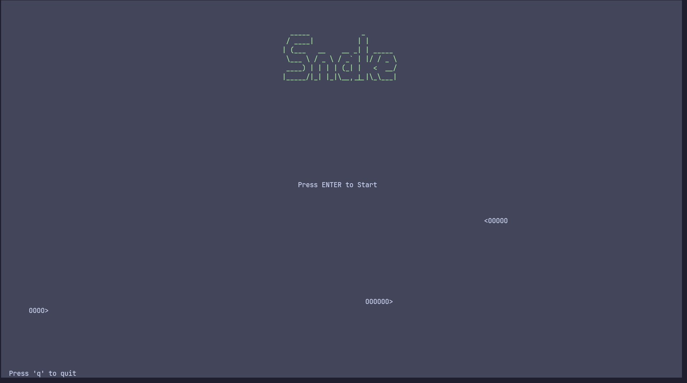
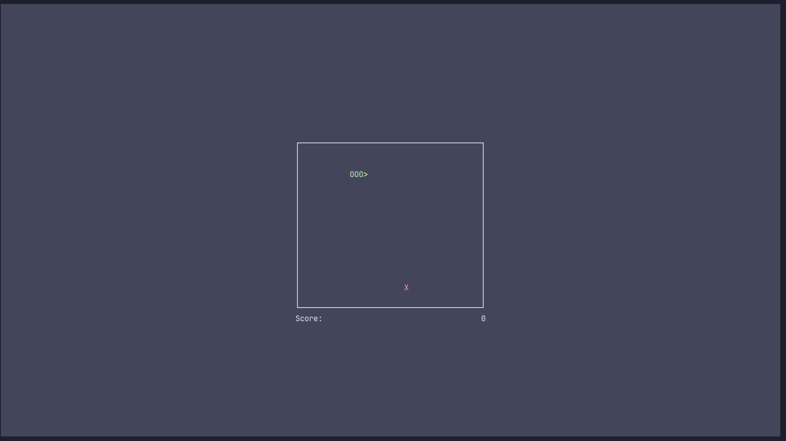

# CSnake

CSnake is a retro-style Snake game fully developed in C, using the ncurses ibrary for console graphics. The goal is to control the snake, eat apples, and avoid crashing into the walls or yourself. The game features a scoring system and simple controls to pause or quit. It is developed for Computer Organization curse.

## Installation

Install the ncurses library:

```sh
sudo apt-get install libncurses5-dev libncursesw5-dev
# or on yum/dnf-based systems:
sudo yum install ncurses-devel
sudo dnf install ncurses-devel
```

## Build

Compile the project by running:

```sh
make -C build
```

## Run

Start the game with:

```sh
./main
```

## Controls

- **P**: Pause the game
- **Q**: Quit the game

## Images




# Docs

## Project Structure

```
.
├── build
│   └── Makefile
├── include
│   ├── board.h
│   ├── menu.h
│   ├── score_board.h
│   ├── snake_game.h
│   └── snake.h
├── main
├── README.MD
└── src
    ├── board.c
    ├── main.c
    ├── menu.c
    ├── score_board.c
    ├── snake.c
    └── snake_game.c
```

## Diagram

Below is the diagram of the project, illustrating the structure and relationships between the main modules and data structures:



---

## Technical Overview

CSnake is organized into modular components, each responsible for a specific aspect of the game. The codebase is structured to separate concerns and facilitate maintainability:

- **main.c**: Entry point of the application. It initializes the ncurses environment, displays the start menu, and manages the main game loop, including game initialization, input processing, state updates, rendering, and cleanup.

- **menu.[c/h]**: Handles the start menu display, including animated demo snakes and user prompts before the game begins.

- **snake_game.[c/h]**: Implements the core game logic. This module manages the game state, including the snake, the board, the score, and the apple. It provides functions to initialize the game, process user input, update the game state (movement, collision, apple consumption), redraw the interface, and clean up resources.

- **board.[c/h]**: Manages the game board using ncurses windows. It provides functions to draw borders, clear and refresh the board, place characters (snake, apple), and handle user input specific to the game area.

- **score_board.[c/h]**: Responsible for displaying and updating the score in a dedicated ncurses window.

- **snake.[c/h]**: Encapsulates the snake's data structure and operations. It manages the snake's body as a dynamic array of pieces, handles movement, growth, and direction changes, and provides utility functions for manipulating the snake.

### Data Structures

- **snake_game_t**: Central structure holding pointers to the board, score board, current score, game state flags, apple position, and the snake instance.
- **Snake**: Represents the snake as a dynamic array of `SnakePiece` structs, along with its current direction, length, and capacity.
- **board_t**: Encapsulates the ncurses window for the game board and its dimensions.
- **score_board_t**: Encapsulates the ncurses window for the score display.

### Flow

1. The game starts by displaying the animated menu.
2. Upon starting, the game initializes the board, score board, and snake.
3. The main loop processes keyboard input, updates the snake's position, checks for collisions or apple consumption, updates the score, and redraws the board and score.
4. The game ends when the snake collides with itself or the board boundaries.

This modular design allows for clear separation of responsibilities and makes the codebase easier to extend or modify.

## References
Based on the C++ implementation by Casual Coder on YouTube: [https://youtu.be/MH6QlYJ2SwU](https://youtu.be/MH6QlYJ2SwU)